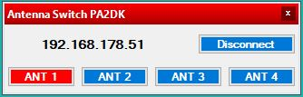

# DXLogAntennaSwitch
Integration of my Remote Antenna Switch for DXLog.

IP Address can be set by provided on the first line in `antenna_switch.txt` which must be created next to the `.dll` file in the CustomForms folder of DXLog.